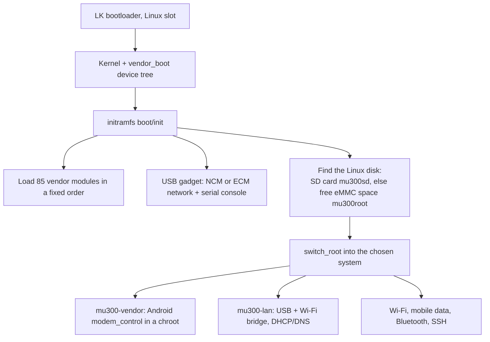

# Building from Source

**In one sentence:** you never need this to install (the installer downloads ready-made images), but everything can be
built from public sources with Docker.

**The simple version:** the releases are bread from the bakery. This page is the recipe, for when you want to bake it
yourself or change an ingredient.

The full, authoritative instructions are in
[docs/BUILD.md](https://github.com/dikeckaan/mu300-linux/blob/main/docs/BUILD.md). This page is a map.

## What a release contains

| File | Contents |
|---|---|
| `mu300-kernel.tar.gz` | Linux 5.4.254 `Image` and modules (with the U30 Air's own), static busybox and logdw, the generic boot ramdisk segment |
| `mu300-kernel-6.18.tar.gz`, `mu300-kernel-7.2.tar.gz` | the mainline kernels and their modules |
| `mu300-ubuntu-rootfs.tar.gz`, `mu300-ubuntu-26.04-rootfs.tar.gz` | Ubuntu 24.04 and 26.04 |
| `mu300-openwrt-rootfs.tar.gz`, `mu300-openwrt-luci-rootfs.tar.gz` | OpenWrt 25.12.5, plain and with the control panel |
| `mu300-extra-lang.tar.gz` | more web interface languages |
| `mu300-update` | the on-device updater |
| `mu300-magisk-*.zip` | Magisk installers, one per system and kernel |
| `SHA256SUMS`, `SHA256SUMS-magisk` | checksums |

The images contain **no proprietary files**; the installer takes those from your own device.

## How a boot goes



## The build in one step

```sh
kernel/build-all.sh    # -> out/Image, out/modules/*.ko, out/modules.builtin*
```

That builds the 5.4 kernel and its Wi-Fi, Bluetooth and Mali modules from pinned public sources with all patches
applied (about 10 minutes on Apple silicon). Then:

* **Root filesystems:** Ubuntu from `rootfs/` (Docker), OpenWrt with `openwrt/build-rootfs.sh`, the control-panel system
  with `MU300_SYSTEM=openwrt-luci openwrt/build-rootfs.sh`.
* **Install your own build:** `./install.sh --build` uses your local kernel outputs and builds the root filesystems
  instead of downloading them.
* **Release:** `tools/make-release.sh TAG --publish` (it refuses to publish an image that contains firmware, Android
  files, host keys or local settings), or the Release workflow in GitHub Actions.
* **Magisk zips:** `tools/make-magisk-zips.sh RELEASE_DIR OUT_DIR`.

## Sources

* 5.4 kernel: ZTE's GPL release for the U30 Air, mirrored at
  [dikeckaan/zte-ums9620-kernel-5.4.254](https://github.com/dikeckaan/zte-ums9620-kernel-5.4.254).
* Wi-Fi, Bluetooth and GPU drivers: realme C51/C53 AndroidT kernel release (GPL-2.0).
* Mainline 6.18 and 7.2: kernel.org Linux plus the port in
  [`upstream/`](https://github.com/dikeckaan/mu300-linux/tree/main/upstream).
* Each release's notes list the exact source commits.

## Other distributions

Debian 13, Kali, Arch Linux ARM and ImmortalWrt build from this repository too; how, and what to expect:
[docs/DISTROS.md](https://github.com/dikeckaan/mu300-linux/blob/main/docs/DISTROS.md). A distribution must be arm64 and
work on the kernel you run; one with a different init system than systemd or procd needs its ~15 services written again.

## Repository layout

| Path | Contents |
|---|---|
| `install.sh`, `install.ps1`, `install.cmd` | installers (macOS/Linux, Windows) |
| `uninstall.*` | removers |
| `kernel/` | kernel build environment, config, patches |
| `upstream/` | the mainline kernel port |
| `boot/` | initramfs `init`, boot image builder, slot handling |
| `rootfs/` | Ubuntu image and the device services in `overlay/` |
| `openwrt/` | OpenWrt builds and the control panel |
| `arch/` | Arch Linux ARM build |
| `android/magisk/` | the Magisk module and zip installer |
| `android-vendor/` | scripts that copy the needed Android files from your device |
| `tests/` | unit tests |
| `tools/` | helpers: backup, logs, release tooling |
| `docs/` | BUILD, DISTROS, FINDINGS |

## Licences

Scripts, tools and documentation: MIT. Kernel and the patches in `kernel/patches`: GPL-2.0. Stock firmware and Android
vendor components belong to their owners and are not distributed here.
