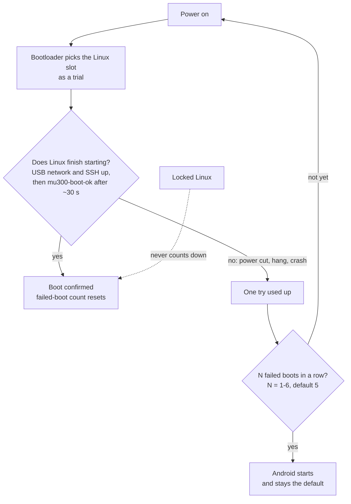

# Going Back to Android

**In one sentence:** Android never leaves the device; `sudo mu300-next-boot android` and a reboot take you back,
`su -c mu300-linux` in Android takes you to Linux again, and `./uninstall.sh` removes Linux completely.

**The simple version:** the device is a house with two rooms. Linux is the room you walk into by default. If the
Linux room's door jams a few times in a row, the device walks into the Android room by itself. You can also just
walk over whenever you like.


## How the automatic fallback works



* The count is chosen at install (1-6, default 5). Change it with `sudo mu300-next-boot attempts N`.
* A boot that never reaches `mu300-boot-ok` (about a minute after power-on) counts as failed. One good boot resets the
  count.
* If Linux does not come up at all, the device also returns to Android, unless Linux is locked.

## Switching by hand

| I want to… | Do this |
|---|---|
| go to Android from Linux | `sudo mu300-next-boot android`, then `sudo reboot` (panel: **Switch to Android**) |
| go to Linux from Android | `su -c mu300-linux` on the device, or the **Action** button of the "MU300 Linux" Magisk module |
| see which system is on which slot (Android) | `su -c 'mu300-linux status'` |
| go to Linux from Android, from a computer | `boot/android-boot-linux.sh work/boot-linux-slotb.img` |
| make Linux the default again | `sudo mu300-next-boot linux` |
| check the boot state | `sudo mu300-next-boot status` |

The installer puts the Magisk module in Android for you. It writes only the same 32 bytes of `misc` that the installer
does. On the panel, "Switch to Android" warns when band or cell locks are still set (those live in the modem and also
apply under Android) and offers to reset them first.

### No password, no computer

If you forgot the password and Linux boots by default: unplug the device about ten seconds after it powers on, plug
it in again, and repeat as many times in a row as your failed-boot count (5 by default). The device then sees
unfinished boots and falls back to Android. A new password can be set from a computer with
`tools/reset-password.sh` without booting Linux (see [Troubleshooting](Troubleshooting#i-forgot-the-password)).
This does **not** work while Linux is locked.

## Locked Linux

```sh
sudo mu300-next-boot lock      # or "Lock Linux" on the panel's home page
sudo mu300-next-boot unlock    # back to the failed-boot attempts
```

Locked, the device **never** goes to Android by itself: not after failed boots, and not when the system does not
start. In that case it waits on USB with a telnet shell at the device's address, where `sh /run/to-android` goes to
Android. Android is then only by hand: `mu300-next-boot android` or "Switch to Android" on the panel.

The one exception is a new kernel: `mu300-update` gives a new boot image its first boots on the usual attempts, so a
kernel that does not start still falls back, and the first good boot locks again.

## Uninstalling

With the device back in Android:

```sh
./uninstall.sh                # macOS / Linux
.\uninstall.ps1               # Windows (PowerShell)
uninstall.cmd                 # Windows (cmd)
```

It makes Android the boot system again, restores the second boot partition and erases the Linux filesystem. Your
Android data is left alone. Like the installer, it offers to reboot the device from Linux into Android first.

| Erase choice | What happens |
|---|---|
| **secure** (default) | overwrites the whole Linux region, then checks it is empty; takes a few minutes |
| **quick** | erases only the filesystem headers; files stay readable on the flash until reused |
| **keep** | leaves the Linux filesystem; it simply never boots again |

On an SD card: **erase** (default) overwrites the first 64 MiB, which is quick (the files stay readable until the
space is reused); **keep** leaves the card. A card with any other filesystem is never touched.

If you shrank `userdata` on the 32 GB variant, the uninstaller offers to grow it back. That is off by default and asks
twice, because it erases Android's data again (and on the 64 GB device would hand Android the free area it has always
had).
