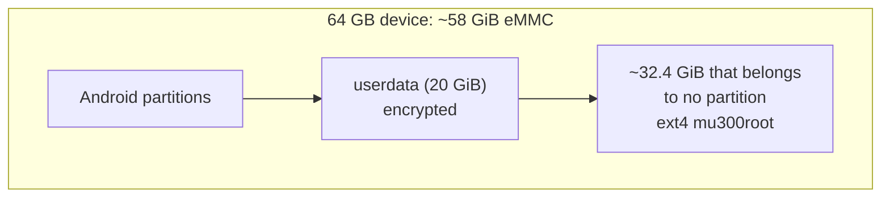

# Hardware Notes

**In one sentence:** the F50 and the U30 Air are the same small Unisoc computer inside, and getting Linux to run on it
meant borrowing a few of Android's own programs and working around some quirky hardware.

This is a friendly summary of [docs/FINDINGS.md](https://github.com/dikeckaan/mu300-linux/blob/main/docs/FINDINGS.md), the
project's lab notebook (symptom, cause, fix for every problem met). Section numbers below (§) point into it.

## The parts

| Item | Value |
|---|---|
| SoC | Unisoc T760 (UMS9620, "qogirn6pro"), board `ums9620_2h10_feimao` |
| RAM | 2 GiB, about 1.4 GiB visible to Linux |
| Storage | eMMC, about 58.25 GiB on the 64 GB device |
| Wi-Fi / Bluetooth | SC2355 "Marlin3" on PCIe |
| GPU | Mali-G57 |
| Bootloader | Unisoc LK, Trusty TEE, A/B slots |
| U30 Air extras | 4050 mAh battery, SGM41511 (bq25601) charger, fuel gauge, NFC tag, Wi-Fi key |

## Where the memory goes (§27)

Of the 2 GiB, the device tree reserves 464 MiB for the modem firmware (needed for 4G/5G), 24 MiB for the trusted OS and
some smaller areas; the kernel and its page tables take the rest. Linux sees about 1473 MiB. Two areas Linux does not need
(the boot logo buffer and bootloader crash dumps) are given back by a kernel patch. zram swap of half the RAM helps.

## Where Linux lives (§9, §9b)

* On the 64 GB device about 32.4 GiB after `userdata` belongs to no partition and reads back empty. Linux puts an ext4
  filesystem there, reached through a loop device at a fixed offset. The partition table and Android are unchanged.
* **Why not a file inside Android's storage?** `userdata` is encrypted as a whole (metadata encryption, with the key held
  by Android), so from Linux it reads as noise.
* **Why not another spare-looking partition?** `blackbox` and `fulldumpdb` look unused, but the firmware writes crash dumps
  into them.
* So the gap is all there is. On the **32 GB variant** there is no gap; shrinking `userdata` (the last partition, so
  nothing else moves) is the experimental way to make one, done by hand on one device so far. The **SD card** (F50) is
  the other way (§31k).

## The modem needs Android's helpers (§5, §18)

The modem and a power-management co-processor are started by Android's own `modem_control` program, which checks its
own process name and expects Android's surroundings. Linux runs it, with `refnotify` and `cp_diskserver`, in a small
Android sandbox (a chroot) with Android's libraries copied from **your** device.

**The 290-second power cut.** Early on, Linux ran fine and then the power simply went off about 290 s after boot. A
watchdog in the power co-processor was never told to stand down, because that message can only be sent after
`modem_control` has started it. Running `modem_control` fixed it (§5).

## Wi-Fi: one job at a time (§14b, §23)

* The chip offers **one** access point: 5 GHz **or** 2.4 GHz, not both.
* It is **either** a hotspot **or** a client of another network. The mode is chosen at boot, so switching to client mode
  needs a reboot; going back to the hotspot does not.
* 5 GHz hotspot mode needed a patch: the firmware takes the channel from a beacon element that standard hostapd only
  adds on 2.4 GHz.
* WPA3-only networks cannot be joined: the driver has no SAE.

## No sound, no screen

* **Sound (§24, §24b):** the board has no speaker path and no microphone; nothing answers at the amplifier's address.
  The whole Unisoc audio stack builds and loads, but no audio moves, and a call without audio ends after about 20 s, as
  under Android on this board. Work in progress, not in releases.
* **Screen:** HDMI over USB-C does not work, because the USB-C power-delivery chip never answers. The device is headless.

## A rare boot hang on 6.18 (§31m, open)

On one board about 2 boots in 50 under 6.18 stop dead in the first seconds (another F50: 0 in 100, as for 7.2). The whole
chip stops without a message, the watchdog resets it, and the bootloader's crash-dump handling uses up several tries, so
the device lands in Android about 20 minutes later. The cause is still open.

## U30 Air: battery, buttons, NFC, USB host

* **Battery (§33d, §36):** level, voltage, current, temperature and charging state in `mu300-toolkit`, the panel and
  `/sys/class/power_supply` on every kernel. Charging: on 5.4 by the vendor charger stack; on 6.18 and 7.2 by the
  `bq256xx` driver from v2026.10.12 on. `mu300-power` adds profiles (`plugged`, `battery`, `saver`, `auto`), idle radios
  and an optional 80 % charge limit; charging pauses above 45 °C.
* **Charging boot:** a start caused by plugging in a charger stays a charging boot (LED blinking, hotspot and modem
  down) until the Wi-Fi key is pressed.
* **LEDs (§33f):** battery (white: Linux is up), network (blue 4G, white 5G, red no service), Wi-Fi (white 2.4 GHz, blue
  5 GHz). `sudo mu300-led test` shows which is which.
* **Heat alarm:** the battery LED flashes red, white, blue in turn when the chip reaches 85 °C or the battery 50 °C
  (`thermal-guard`). On the F50 the network LED does this.
* **Buttons:** power: a short press wakes the LEDs, held 3 s shuts down. Wi-Fi key: switches 2.4 / 5 GHz, held 3 s turns
  the hotspot off or on.
* **NFC (§33g):** a phone held to the device can join the hotspot: `sudo mu300-nfc wifi` writes the hotspot's name and
  password into the tag (also `url`, `text`, `clear`, `on`/`off`).
* **USB host (§33e):** `sudo mu300-usb host` with an OTG adapter, on the mainline kernels: flash drives (FAT, exFAT),
  keyboards, mice, USB modems and Ethernet adapters. `sudo mu300-usb device` goes back (the default at every boot).
* **Address:** `192.168.78.1`, so an F50 (`192.168.77.1`) and a U30 Air can be plugged into one computer (§33b).

## F50 specifics

* USB only (no battery); its USB port is its power supply, so no USB host mode.
* LEDs: network (blue 4G, white 5G, red no service) and Wi-Fi (on while the hotspot is up).
* An SD card slot that can hold the Linux filesystem.

## Odd numbers that are normal

* **Load average around 12 on 5.4** (§6): vendor kernel threads waiting in D state are counted; `top` shows the CPU about
  98 % idle.
* **Kernel warnings on 6.18** were traced to three vendor bugs and fixed (§31g).

For anything deeper, the [FINDINGS contents table](https://github.com/dikeckaan/mu300-linux/blob/main/docs/FINDINGS.md#contents)
lists every section with its state (current, superseded, open).
