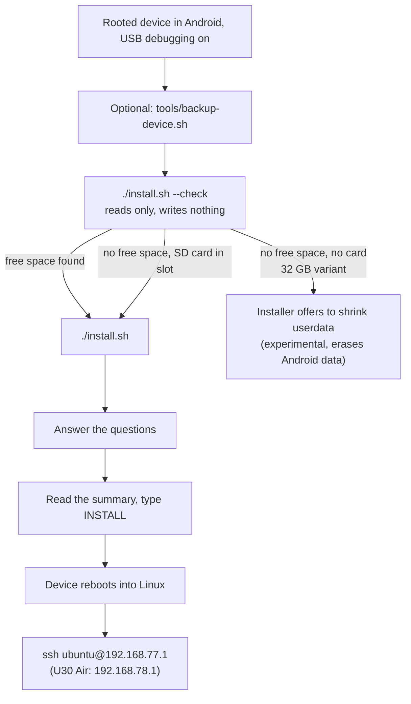
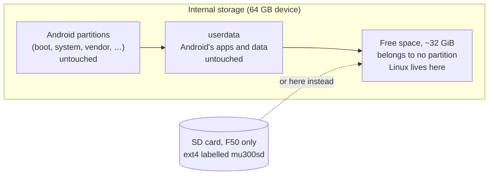

# Installation

**In one sentence:** you plug the rooted device into a computer, run one script that first only *looks*, then run
it again to install, answer a few questions, type `INSTALL`, and the device restarts into Linux.

**The simple version:** the installer is a careful mover. It measures the empty room first (`--check`), tells you
exactly which boxes it will put where, waits for you to say yes, and never moves Android's furniture.

> **Hobby project, no warranty.** Rooting and unlocking are not part of this project and happen at your own risk.
> A wrong step, a power cut or a bad cable can still leave a device unusable. Keep a backup. See the
> [full notice](https://github.com/dikeckaan/mu300-linux#a-hobby-project-at-your-own-risk).



## What you need

* A **ZTE F50 / MU300** or **ZTE U30 Air** that is already **rooted and unlocked**: it must already boot a modified
  Android boot image. Getting there is not part of this project.
* **USB debugging** enabled, and the device connected by USB.
* A computer with **`adb`**:
  * **macOS or Linux:** also Python 3, `lz4` and `curl` (usually already there).
  * **Windows 10/11:** PowerShell. The installer installs Python 3 (for your user, with winget or from python.org)
    and its `lz4` module itself when they are missing. Use `install.ps1`, or `install.cmd` from cmd.exe (no
    execution-policy change needed).
* About 15 minutes.

Get the project with `git clone https://github.com/dikeckaan/mu300-linux` or download it as a zip from GitHub. You
do not need to download the images yourself: the installer fetches the newest release and checks its SHA256 sums.

## What gets written (and what never does)

* Linux goes into **empty, unused space** on the internal storage (about 32 GiB on the usual 64 GB device), or onto
  an **SD card** (F50 only).
* The installer writes the boot partition of the slot Android is **not** on (`boot_b`, or `boot_a` when Android runs
  from slot b, as it often does after an OTA update) and **32 bytes of `misc`**.
* On the 64 GB device, **Android, its data and the partition table are never modified.**
* The exception is the 32 GB variant, see below.



## Step 0: back up what cannot be replaced (recommended)

```sh
tools/backup-device.sh          # macOS / Linux, device in rooted Android
```

It copies your unit's own data (`prodnv`, the modem calibration and IMEI partitions, the bootloader chain) to your
computer and verifies every dump. Installing never touches these, but if they are ever lost no firmware download can
bring them back. Keep the folder private: it contains your IMEI.

## Step 1: check the device (reads only)

```sh
./install.sh --check          # macOS / Linux
.\install.ps1 -Check          # Windows (PowerShell)
install.cmd -Check            # Windows (cmd)
```

It prints the storage size, where Android's partitions end and how much free space follows. What the result means:

| `--check` says | Meaning |
|---|---|
| about 32 GiB free, `OK: free and empty, same layout as the tested device` | the usual 64 GB device, ready |
| `OK: free and empty, smaller than on the tested device but enough for both systems` | fine |
| `room for one system only` / `OpenWrt fits, Ubuntu does not` | a smaller gap: pick accordingly |
| no free space at all | the **32 GB variant** (see below) |
| `the installer will offer the SD card instead` | no room inside, but a card is in the slot: no repartitioning needed |
| `WARNING: the unpartitioned space is not empty` | something wrote there; installing would overwrite it (you would have to type `overwrite`) |

If the numbers look like none of these, stop and [open an issue](https://github.com/dikeckaan/mu300-linux/issues)
with what `--check` printed.

### The 32 GB variant

On the 32 GB device `userdata` fills the whole disk, so there is no free space. You have two ways:

* **An SD card (F50):** erases nothing on the internal storage. The installer offers it.
* **Shrink `userdata`:** the installer can make room, asks how many GiB to give Linux and keeps at least 4 GiB for
  Android. **This rewrites the partition table and erases everything in Android. It is experimental** and you must
  type `ERASE`. Take a full backup with `tools/backup-device.sh` first. Android sets its data up again on the next
  boot; then run the installer again.

### The SD card (F50 only)

With a card of at least 700 MiB in the slot, the installer asks whether Linux goes there or into the internal free
space (`MU300_STORAGE=sd` answers it). The card is formatted as ext4 labelled `mu300sd`; a card that holds another
Linux (ext4) filesystem is never formatted. Insert the card while the device is **off**. A `mu300sd` card always
starts first. Note: the boot image starts *any* card labelled `mu300sd`, so whoever holds the device can start a
system of their own from a card. The U30 Air has no card slot.

## Step 2: install

```sh
./install.sh                  # macOS / Linux
.\install.ps1                 # Windows (PowerShell)
install.cmd                   # Windows (cmd)
```

First it brings your copy of the project up to date from GitHub and restarts itself if anything changed
(`MU300_NO_SELF_UPDATE=1` / `-NoSelfUpdate` skips that). Then it asks the language: English, Türkçe or 中文
(`MU300_LANG=tr` or `.\install.ps1 -Lang zh` skips the question).

### The questions, one by one

| The installer asks | What it means | If unsure |
|---|---|---|
| *Where should the Linux filesystem go: internal storage or the SD card?* (only with a card) | where Linux lives | `internal` on a 64 GB device |
| *What should be installed?* 1) Ubuntu LTS 2) OpenWrt 3) both | the system(s); see [Choosing a System](Choosing-a-System) | 3 (both) is the default |
| *Which OpenWrt?* 1) the standard LuCI web interface 2) with the MU300 control panel | plain OpenWrt, or OpenWrt with the modem panel | see [Control Panel (LuCI)](Control-Panel-(LuCI)) |
| *Which one should boot* | with two systems: which starts first | either; switch later with `mu300-os` |
| *Which Ubuntu?* 1) 24.04 LTS 2) 26.04 LTS | Ubuntu release | 24.04 (the longest tested) |
| *Boot Linux by default instead of Android?* | yes: Linux starts on every power-on, Android after failed boots | yes |
| *Failed boots before Android (1-6)* | how many unfinished starts in a row before it gives up and goes to Android | 5 (default) |
| *Copy Android's hotspot name and password to Linux?* | your Wi-Fi keeps its name and password | yes |
| *Include the Mali GPU (OpenCL) userspace (~90 MiB)?* | GPU compute support | yes |
| *Install the VPN module?* | the optional [VPN](VPN) (about 40 MB to download) | no, add it later if needed |
| *Which kernel?* 1) 5.4 2) 6.18 3) 7.2 | the core of Linux; see [Kernels](Kernels) | 1 (5.4), or 2 (6.18) for Ubuntu 26.04 |
| *update or wipe* (only when Linux is already there) | `update` keeps settings and data, `wipe` starts fresh | update |
| *Password for the "ubuntu" user (Ubuntu) and "root" (OpenWrt)* | your login password, at least 6 characters | choose a good one |

**About the failed-boot count:** a boot counts as failed when it never finishes starting up (power goes, the battery
runs out, Linux hangs) before about a minute after power-on. One good boot resets the count. Higher is more
forgiving of flaky cables; lower gets you to Android sooner. It is also your way back to Android without a computer:
cut the power while it is starting that many times in a row.

### The summary, and `INSTALL`

The installer downloads the images, copies the Wi-Fi and modem files **from your own device** (the published images
contain no proprietary files), then shows exactly what it will write, for example:

```
==> Ready to install
  systems:        ubuntu openwrt (Ubuntu 24.04) (boots: ubuntu)
  kernel:         6.18 (mainline, …)
  default boot:   Linux (Android after 5 failed boots in a row)
  filesystem:     CREATE new ext4 (erases the Linux region)
  writes:         Linux region at offset …, boot_b, 32 bytes of misc (boot_a, GPT and userdata are not touched)
Type INSTALL to continue [no]:
```

Type `INSTALL` (in capitals) to go ahead; anything else cancels. It also installs a small Magisk module in Android
so you can start Linux from Android later, then reboots into Linux.

If the device is running Linux rather than Android when you start, the installer notices and offers to reboot it into
Android for you over SSH.

## Step 3: log in

Wait about a minute, then on the computer the device is plugged into:

| | F50 / MU300 | U30 Air |
|---|---|---|
| Ubuntu | `ssh ubuntu@192.168.77.1` | `ssh ubuntu@192.168.78.1` |
| OpenWrt | `ssh root@192.168.77.1` | `ssh root@192.168.78.1` |
| OpenWrt web interface | http://192.168.77.1 | http://192.168.78.1 |

Use the password you chose. The Wi-Fi network the device broadcasts is its hotspot; unless you chose otherwise it has
the name and password copied from Android. A USB serial console is there too: `screen /dev/cu.usbmodem* 115200` on
macOS. Then try `sudo mu300-toolkit`.

**macOS tip:** macOS does not set up a network interface it has never seen while the screen is locked. Unlock the Mac
the first time you plug the device in.

## Installing from Android with a Magisk zip (no computer)

If the device runs a rooted Android with **Magisk 26 or newer**, Linux can be installed from the device itself. Each
release has one zip per system and kernel, 11 in all, e.g. `mu300-magisk-<tag>-ubuntu-24.04-k5.4.zip` or
`mu300-magisk-<tag>-openwrt-luci-k7.2.zip` (OpenWrt with the control panel); the same zip works on the F50 and the
U30 Air and finds the place by itself. There is no Ubuntu 26.04 zip with kernel 5.4.

1. Put the zip on the device and open it in the Magisk app (Modules, Install from storage), or run
   `su -c 'magisk --install-module /sdcard/Download/<zip>'`. Not from recovery.
2. Read the output: it shows the device, where Linux goes, what it writes and the **password it generated**, which
   is also in `/data/adb/mu300-linux-password.txt` (read it with `su -c cat /data/adb/mu300-linux-password.txt`,
   delete it after the first login).
3. Reboot. If Linux does not start, the device returns to Android by itself.

Magisk cannot ask questions, so choices go in a settings file, `mu300-install.conf`. Shrinking `userdata` is not
offered from a zip. The keys, where the file may live and the rules for erasing are in the
[README](https://github.com/dikeckaan/mu300-linux#choosing-something-else-mu300-installconf).

## Downloads are slow?

GitHub's release CDN throttles single connections in some regions. The installer already downloads in 8 parallel
chunks; `MU300_FETCH_JOBS` changes that, and `MU300_RELEASE_URL` points it at your own mirror.

## Next

* [Choosing a System](Choosing-a-System) and [Kernels](Kernels), if you have not decided yet
* [Going Back to Android](Going-Back-to-Android)
* [Troubleshooting](Troubleshooting)
* The illustrated guide: https://kaandikec.com/mu300-linux/install/
