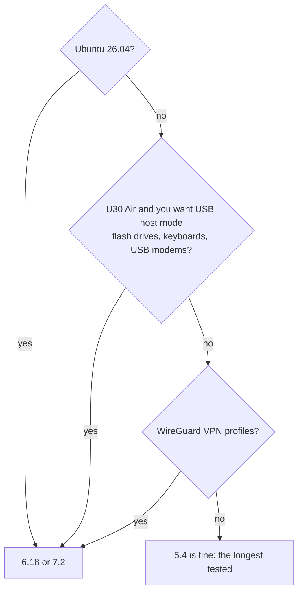

# Kernels

**In one sentence:** the kernel is the engine underneath Linux; you can choose Unisoc's own **5.4** (oldest, longest
tested), mainline **6.18** (long-term support) or mainline **7.2** (newest), and change your mind later with one
command.

**The simple version:** all three engines drive the same car: hotspot, mobile data, SMS, Bluetooth, VPN, GPU. 5.4 is
the one the factory built and the most proven; 6.18 and 7.2 are the regular Linux everyone uses, with newer parts.

## The choice, as the installer puts it

| choice | kernel | |
|---|---|---|
| 1 | **5.4** | Unisoc's vendor kernel (Android 12 base): the longest tested, everything this project supports |
| 2 | **6.18** | mainline Linux, the current long-term (LTS) release: newer drivers and security fixes, the same functions (hotspot, mobile data, SMS, Bluetooth, VPN, GPU); no USB-C video output yet |
| 3 | **7.2** | the newest stable mainline release (7.2 for now): the newest drivers, the same functions as 6.18; tested less than 6.18 |

## Which one should I take?



* **Ubuntu 26.04 needs 6.18 or 7.2.** Its programs use system calls 5.4 does not have.
* **USB host mode on the U30 Air** (`mu300-usb host`) needs a mainline kernel.
* **WireGuard:** the VPN module notes that the 5.4 vendor kernel has no WireGuard; mainline does.
* **KVM** (`/dev/kvm`) is on all three.
* **The mainline bundles** carry about 360 modules: WireGuard, SQM, tunnels, USB adapters and modems,
  NTFS/exFAT/btrfs/NFS/CIFS, dm-crypt, containers.
* **U30 Air battery:** readings work on every kernel. Charging on the mainline kernels is driven by the `bq256xx`
  driver from v2026.10.12 on; the mainline kernels of v2026.10.11 and older leave charging off, so use 5.4 there.

## Known issue: a rare hang on 6.18

About once in 20 boots on one board, 6.18 stopped in its first seconds; the device then falls back to Android (it
can take around 20 minutes, because each hang uses up several tries). Another F50 showed 0 hangs in 100 boots, as did
7.2. Start Linux again with `su -c mu300-linux` in Android or the Magisk module's Action button. Details:
[FINDINGS 31m](https://github.com/dikeckaan/mu300-linux/blob/main/docs/FINDINGS.md#31m-hard-hangs-in-the-first-seconds-under-618-open).

## Changing the kernel later

On the device:

```sh
sudo mu300-update kernel            # shows the current one
sudo mu300-update kernel 6.18       # or 5.4, 7.2
sudo reboot
```

The previous kernel and boot image are kept: `sudo mu300-update rollback-boot` goes back. A new kernel that does not
start sends the device back to Android after the usual number of failed boots, even when Linux is locked (see
[Going Back to Android](Going-Back-to-Android)).

## Where the kernels come from

* **5.4** is built from ZTE's published GPL source for the U30 Air (mirrored at
  [dikeckaan/zte-ums9620-kernel-5.4.254](https://github.com/dikeckaan/zte-ums9620-kernel-5.4.254)), with Wi-Fi,
  Bluetooth and GPU drivers from realme's C51/C53 kernel release.
* **6.18 and 7.2** are Linux from kernel.org with this project's patches and the vendor drivers ported to them
  ([`upstream/`](https://github.com/dikeckaan/mu300-linux/tree/main/upstream)). A CI job builds the port every week
  against the newest longterm and stable kernels.

The F50 and the U30 Air run the same kernel; the U30 Air's boot image loads a handful of different drivers for its
charger and LEDs.
