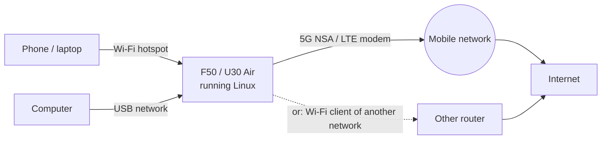

# Mobile Data and APN

**In one sentence:** put a SIM with a data plan in the device and Linux connects to 5G (NSA) or LTE by itself and
shares the connection with everything on its Wi-Fi and USB.

**The simple version:** the modem is a little phone inside the box. Linux dials in for you, keeps watching the line,
and dials again if it drops. Most SIM cards need no settings at all.




## Check it

```sh
sudo mobile-data status
```

No `sudo` on OpenWrt. The connection reconnects by itself after modem resets (`mu300-mobile-data-watch`), unless you
took it down yourself with `mobile-data down`. Other subcommands: `up [APN]`, `down`, `signal`, `sim-reset`.

**No internet?** First check that the SIM has a **data plan**. A missing plan looks like a connection that keeps
dropping.

## The APN

**Leave it empty unless your carrier says otherwise.** Empty means: use the data context the SIM itself defines,
which is what most carriers expect.

| System | Where |
|---|---|
| Ubuntu | `/etc/mu300/mobile-data.conf`: `MU300_APN` and `MU300_PDP_TYPE` (an example is in `/etc/mu300/mobile-data.conf.example`) |
| OpenWrt | LuCI -> Network -> Interfaces -> wan, or `uci set network.wan.apn='…'; uci commit network; ifup wan` |

## Network, band and cell locks (control panel)

On OpenWrt with the control panel, **Cellular -> Network locks** sets network mode, band, cell and EN-DC locks that
persist across reboots and are replayed at boot. The locks are stored in the modem's own memory, so **they also apply
in Android**. "Reset all to automatic" on that page (or `unisoc-modem lock reset` on the command line) clears them.
The **Status dashboard** shows live signal, bands, cells and temperatures. See [Control Panel (LuCI)](Control-Panel-(LuCI)).

## USSD (balance, own number)

```sh
sudo mu300-ussd '*101#'
```

The code depends on your carrier.

## TTL

```sh
sudo mu300-ttl set 64     # a fixed TTL for everything leaving through mobile data
sudo mu300-ttl off        # back to the default
```

Also in `mu300-toolkit` -> Network -> TTL, or the panel's Cellular -> TTL. On the mainline kernels the rule is in tc
and flow offloading stays on; on 5.4 it is in nftables and offloading is off while a TTL is set.

> Changing what your device sends (TTL, band locks, VPNs) may break your operator's terms or local law. Check before
> you turn something on.

## IPv6

Plain OpenWrt uses prefix extension; OpenWrt with the control panel relays IPv6 from the carrier (router
advertisements and NAT66) instead. On the panel system a prefix the carrier has withdrawn can stay advertised on the LAN until it expires (a
known issue in v2026.10.17).

## Wi-Fi beats mobile data

When the device is also joined to another Wi-Fi network as a client, the Wi-Fi route (metric 50) wins over mobile data
(metric 100), so the SIM stays idle. See [Wi-Fi Hotspot and Client](Wi-Fi-Hotspot-and-Client).

## "Websites think I am in another country"

The device has no GPS, so websites guess your location from the IP address, and mobile operators often look like a
different city.

## Saving power (U30 Air)

`mu300-power` can switch the radio to LTE only or off while nobody is connected. See the
[README's power row](https://github.com/dikeckaan/mu300-linux#everyday-use) and
[Hardware Notes](Hardware-Notes#u30-air-battery-buttons-nfc-usb-host).

Deep details (radio registration, the data bearer, modem resets):
[FINDINGS 15, 26](https://github.com/dikeckaan/mu300-linux/blob/main/docs/FINDINGS.md).
