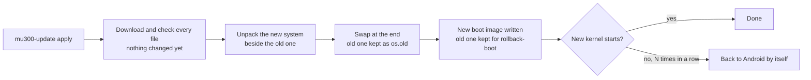

# Updating

**In one sentence:** `sudo mu300-update check` tells you whether there is a new release, `sudo mu300-update apply`
installs it on the device itself, and `rollback` takes you back if you do not like it.

**The simple version:** the device builds the new system next to the old one, and only swaps them at the very end.
If the download breaks halfway, nothing has changed. The old one stays in the cupboard until you throw it away.

## Commands

```sh
sudo mu300-update check           # installed version vs newest release
sudo mu300-update apply           # system, kernel and boot image: download, unpack, switch; then reboot
sudo mu300-update rollback        # back to the previous system
sudo mu300-update rollback-boot   # back to the previous kernel and boot image
sudo mu300-update kernel 7.2      # another kernel: 5.4 (vendor), 6.18 (LTS) or 7.2; no argument shows the current one
sudo mu300-update clean           # delete the kept previous version
```

On OpenWrt you are already root, so leave out `sudo`. `mu300-toolkit` offers the same under
**System -> Software update**. Reboot after `apply` to start the new system and kernel.

The device looks for a new release at boot and every 6 hours and tells you at login and in `mu300-toolkit`. **It
never installs one by itself.**

## What an update keeps

* your settings (`/etc/mu300`: hotspot, VPN, toolkit), users and home directories, `/usr/local`, SSH host keys,
  OpenWrt's UCI configuration and services you enabled yourself;
* the vendor files copied from your device (Wi-Fi firmware, the Android modem userspace);
* the installed extras: the lang extra is brought to the new release, the [VPN](VPN) module to its latest release;
* packages you installed yourself (`apk add`, `apt install`): see below.

## Packages you installed yourself

The release's image has only its own packages. `apply` lists the ones you added before it switches, and the new
system installs them again at its first boot, once it is online (an hour of tries, then again at the next boots, five
at most). Until they are back their OpenWrt settings (`/etc/config/<name>`) wait in `/etc/mu300/orphaned-config/`:
settings without their program used to stay active - OpenClash's left the device without DNS. A package the feeds do
not have (installed from a `.apk` file) cannot come back by itself; its settings stay aside.

```sh
mu300-user-packages status    # what came back, what failed and why, how to put settings back
mu300-user-packages retry     # try again now
mu300-user-packages repair-dns  # a proxy that is gone left dnsmasq pointing at it: remove that (never done by itself)
mu300-update apply --no-reinstall   # update without installing them again (MU300_KEEP_PACKAGES=0 does the same)
```

## Why it is safe



* Every file is downloaded and checked before anything changes.
* From v2026.09.28 on, `apply` first switches to the updater of the release it installs.
* The boot image keeps your device's own part and gets the release's kernel and the generic part of its ramdisk, so
  no computer and nothing from Android is needed.
* A kernel that does not start sends the device back to Android after the usual number of failed boots. Even when
  Linux is [locked](Going-Back-to-Android#locked-linux), a new boot image gets its first boots on the usual attempts.

### With the VPN on

A device that uses the VPN is never updated without it. Offline, the update stops **before** it changes anything and
says how to stage the module: put `mu300-linux-vpn.tar.gz` and its `SHA256SUMS` in
`/mnt/mu300-disk/.mu300-update/vpn/`, or run `MU300_VPN_MODULE=FILE mu300-update apply`.

## Changing the Ubuntu release

```sh
sudo MU300_UBUNTU=26.04 mu300-update apply   # or 24.04
```

Settings and data are kept. Ubuntu 26.04 needs kernel 6.18 or 7.2.

## Updating with the computer installer instead

Run `./install.sh` again and answer **update** when it asks *update or wipe*. It reinstalls the systems, writes a fresh
boot image and keeps your settings and data. It also sets the password you type there.

## Coming from a very old release

**v2026.09.27 or older:** fetch the new updater first, then update, both right after a reboot (older boot images can
lose mobile data after a few quiet minutes):

```sh
sudo curl -fL https://github.com/dikeckaan/mu300-linux/releases/latest/download/mu300-update -o /opt/mu300/bin/mu300-update
sudo mu300-update apply
```

On OpenWrt, as root:

```sh
wget -O /opt/mu300/bin/mu300-update https://github.com/dikeckaan/mu300-linux/releases/latest/download/mu300-update
mu300-update apply
```

**Back in Android after an update?** With older boot images a single crash of Linux could leave the device in
Android. Start Linux with `su -c mu300-linux` (or the Magisk module's Action button), then update as above. If Linux
does not start any more, run the computer installer and choose `update`.

**From v2026.10.14 or older** an update prints "could not arm the Linux slot for a trial", because the older
`mu300-next-boot` does not know `--trial`. The fallback to Android after failed boots still works.

## Do not

* Do not use OpenWrt's `sysupgrade` or flash OpenWrt firmware images.
* Do not `apk upgrade` the `kernel` or `kmod-*` packages on OpenWrt.
