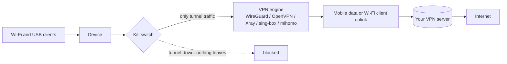

# VPN

**In one sentence:** an optional module, `mu300-vpn`, sends the device's own traffic **and** everything from its
Wi-Fi and USB clients through your VPN server, with a kill switch so nothing leaks when the tunnel is down.

**The simple version:** imagine every parcel leaving the house going into a locked van first. The kill switch means
that if the van is not there, parcels wait at the door instead of being sent unprotected.

The VPN is a separate project with its own releases: **[dikeckaan/mu300-linux-vpn](https://github.com/dikeckaan/mu300-linux-vpn)**.
Its README is the full reference (commands, profiles, settings, security model). This page is the short tour.



## Install the module

It needs mu300-linux **v2026.10.16 or newer**. The installer asks about it; otherwise, on the device:

```sh
sudo mu300-extra install vpn                                # online: the module's latest release, checked against its SHA256SUMS
sudo mu300-extra install vpn --from mu300-linux-vpn.tar.gz  # offline: a copy brought onto the device (USB, scp)
sudo mu300-extra install vpn --from /mnt/usb/               # offline, verified: a directory with the tarball and its SHA256SUMS
sudo mu300-extra install vpn-mihomo                         # mihomo, for Clash/mihomo profiles
sudo mu300-extra remove vpn                                 # turn the VPN off first
```

On OpenWrt leave out `sudo`. The module lives on the Linux partition (`/mnt/mu300-disk/extra/vpn`), so Ubuntu and
OpenWrt share one copy, and updates keep it.

## Use it

```sh
sudo mu300-vpn profile import ~/office.conf Office    # a file: WireGuard .conf, .ovpn, Xray/sing-box .json, mihomo .yaml
cat client.ovpn | sudo mu300-vpn profile import -     # from stdin, so nothing is left in the process list
mu300-vpn profile list                                # * marks the active one
sudo mu300-vpn profile use office                     # make it active
sudo mu300-vpn on                                     # start now and at every boot
mu300-vpn status                                      # profile, engine, tunnel, exit IP (never a secret)
sudo mu300-vpn off                                    # stop, and remove the kill switch
```

Share links (`vless://`, `vmess://`, `trojan://`, `ss://`) can be imported too; prefer stdin for them so the link does
not end up in your shell history. `mu300-toolkit` has a VPN menu.

## What it supports

| Profile | Engine |
|---|---|
| WireGuard `.conf` | the kernel's WireGuard (the mainline kernels; the 5.4 vendor kernel has none) |
| OpenVPN `.ovpn` | the system's OpenVPN package: `apt-get install openvpn` (Ubuntu), `apk add openvpn-openssl` (OpenWrt) |
| VLESS, VMess, Trojan, Shadowsocks links; Xray JSON | Xray-core with hev-socks5-tunnel |
| the same links behind the kill switch; sing-box JSON | sing-box |
| Clash/mihomo YAML | mihomo (`mu300-extra install vpn-mihomo`) |

Tailscale's own traffic goes through the tunnel by default.

## Settings worth knowing

`mu300-vpn settings set KEY VALUE`, from the module's README:

| Key | Default | Meaning |
|---|---|---|
| `KILL_SWITCH` | 1 | nothing but the tunnel leaves the device, also while the tunnel is down |
| `TAILSCALE` | 1 | Tailscale's traffic through the tunnel |
| `IPV6` | 0 | IPv6 through the tunnel too, when the tunnel has an IPv6 address |
| `REMOTE_DNS` | 1.1.1.1 | DNS for the device and its clients, through the tunnel |
| `LAN_CIDRS` | empty | more networks that stay local (the device's own LAN always does) |

## Fails closed

* A device whose VPN is on is never updated without the module. Offline, `mu300-update apply` stops before changing
  anything and says how to stage it (see [Updating](Updating#with-the-vpn-on)).
* A system whose VPN is on with the kill switch and has lost the module keeps mobile data and the Wi-Fi client
  **down** until the module is installed again (`mu300-extra install vpn`) or the VPN is turned off.

## Known limits

Some carriers drop UDP and block OpenVPN by deep packet inspection. A raw Xray/sing-box/mihomo config that contains a
`direct`/`freedom` outbound sends that traffic outside the tunnel, past the kill switch, by its own choice.

> Using a VPN may break your operator's terms or local law. Check before you turn it on.
