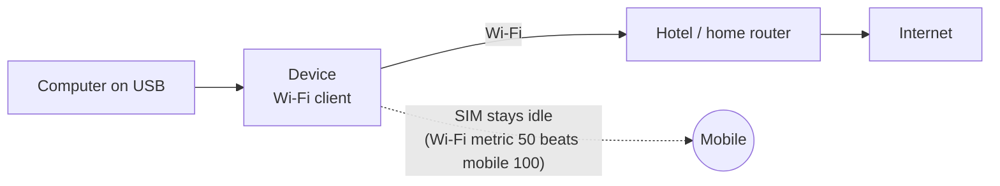

# Wi-Fi Hotspot and Client

**In one sentence:** the device's Wi-Fi is either a **hotspot** that your phones and laptops join, or a **client**
that joins someone else's Wi-Fi, one or the other, never both at once.

**The simple version:** the Wi-Fi radio is one mouth. It can either talk (be the hotspot) or listen (join another
network), not both at the same time. The hotspot is the default.

## The hotspot

* **5 GHz (802.11ac) or 2.4 GHz**, one at a time: the chip (SC2355) offers only one access point.
* By default it uses the **name and password copied from Android** (the installer asks). Without that, a random
  password is generated and shown at login.
* Wi-Fi clients and USB clients share one LAN, so they can see each other and the device.

### Change the name, password or band

| System | How |
|---|---|
| Ubuntu | edit `/etc/mu300/hotspot.conf` (`SSID=`, `PSK=`, `BAND=5` or `2.4`, `CHANNEL=auto` or a number, `COUNTRY=`), then `sudo systemctl restart mu300-hotspot` |
| OpenWrt | LuCI -> Network -> Wireless (the `hotspot.conf` file is only read once, at the first boot) |
| U30 Air | the Wi-Fi key switches 2.4 / 5 GHz; held 3 s it turns the hotspot off or on |

On 5 GHz the firmware allows channels 36-48 and 149-165; if it refuses 5 GHz, the hotspot falls back to 2.4 GHz.

## The Wi-Fi client (join another network)



```sh
sudo wifi-client scan                    # the networks in range: signal, security, name
sudo wifi-client connect "NAME"          # asks for the password; nothing is shown as you type
sudo wifi-client connect "NAME" --open   # an open network
sudo wifi-client status
sudo wifi-client disconnect              # the hotspot comes back, and stays after a reboot
sudo wifi-client reconnect               # join the saved network again
sudo wifi-client forget                  # delete the saved network
```

Or use the menu: `sudo mu300-toolkit` -> Network -> Wi-Fi -> "Join a network".

**Good to know:**

* **The mode is decided at boot.** While the radio is the hotspot, `connect` saves the network and asks for a reboot
  (`mu300-toolkit` offers a reboot with the hotspot off, to scan).
* **WPA2 and WPA2/WPA3 mixed networks work; WPA3-only networks do not.** This driver has no SAE. The scan labels them
  `WPA3`; set the router to WPA2/WPA3 mixed mode to join it.
* **Type the password when asked**, not on the command line: `sudo` writes the whole command line to the system log.
  From a script: `printf '%s\n' "$PW" | sudo wifi-client connect "NAME" -`, or `--password-file FILE`.
* The joined network is saved in `/etc/mu300/wifi-client.conf` (root only) and joined again at every boot.
* `disconnect` lasts across reboots; `disconnect --keep` leaves the network joined at the next boot.
* When the Wi-Fi chip's firmware crashes, the driver resets it and the Wi-Fi comes back by itself: the hotspot since
  v2026.10.17, a Wi-Fi client of another network since v2026.10.18 (it used to reboot the device).

### What is shared, and what is not

USB clients reach the **internet** through the joined network, and only the internet: the other network's own devices
and router (private, link-local, CGNAT and other special addresses), and anything over IPv6, are not reachable from
the device's LAN. So a guest on the device's USB does not end up on your home or hotel network. From the joined network
only ping, DHCP, IPv6 neighbour discovery and replies come in: SSH and the device's other services are closed to it (use
USB to reach the device). With the [VPN](VPN) on, traffic still goes through the tunnel and the kill switch covers the
Wi-Fi uplink too. The full firewall description is in the
[README](https://github.com/dikeckaan/mu300-linux#wi-fi-client).

## Known issues

* Under sustained Wi-Fi load the vendor driver logs `edma_pending_q_buffer full` / `push link fail` while it drops
  packets; the transfer completes.
* Suspend with the hotspot up returns at once (hostapd's alarm timer).

Why one mode at a time and why 5 GHz needed a patch:
[FINDINGS 14b, 23](https://github.com/dikeckaan/mu300-linux/blob/main/docs/FINDINGS.md).
